# Project Workflow & Processes

This document is the master blueprint for our AI-driven development lifecycle. It outlines the key workflows, roles, and processes we will use to build and manage the Hub and EVV projects.

## Master Development Workflow

The following diagram illustrates our complete, end-to-end process, from initial idea to production deployment. It includes our design, mockup, decomposition, development, testing, and review phases.

```mermaid
graph TD
    subgraph "Phase 1: Design (You & AI BA)"
        A[1. You: Define Requirement] --> B[2. AI BA: Generate User Story];
        B --> C[3. AI BA: Submit Story PR to platform-architecture];
        C --> D{4. You: Review Story PR};
        D -- Approved --> E[5. You: Merge Story PR];
    end

    subgraph "Phase 2: UI/UX Mockup (You, AI UI/UX, & SME)"
        E --> F{6. Does story need a UI?};
        F -- Yes --> G[7. You: Brief AI UI/UX Designer];
        G --> H[8. AI UI/UX: Generate Mockups];
        H --> I[9. You: Add mockup to Story PR];
        I --> J{10. SME: Review Mockup PR};
        J -- Approved --> K[11. You: Merge Mockup PR];
        F -- No --> K;
    end

    subgraph "Phase 3: Decomposition (Automated)"
        K --> L[12. You: Trigger 'Decompose Story' Action];
        L --> M[13. GitHub Action: Reads story, briefs AI];
        M --> N[14. AI Decomposer: Returns JSON of nuclear tasks];
        N --> O[15. GitHub Action: Creates GitHub Issues];
        O --> P[16. GitHub Action: Adds Issues to Project Board];
    end

    subgraph "Phase 4: Development & Deployment"
        P --> Q[17. AI Coder is assigned an Issue];
        Q --> R[18. AI Coder: Writes Code & submits PR];
        R --> S[19. CI Pipeline: Runs tests];
        S -- Fails --> R;
        S -- Passes --> T{20. You: Review Code PR};
        T -- Revisions Needed --> R;
        T -- Approved --> U[21. You: Merge PR to 'staging'];
        U --> V[22. Automated Deploy to Staging];
        V --> W{23. You & SMEs: Perform UAT};
        W -- Fails --> X[Create new Bug Issue];
        X --> P;
        W -- Approved --> Y[24. You: Trigger Prod Deploy];
        Y --> Z((Done));
    end
```

## Key Work Artifacts & Locations

- **User Stories:** Live inside Markdown files in the `platform-architecture/user_stories/` directory. They are the "what" and "why."
- **API Contracts:** Live as OpenAPI `.yaml` files in the `platform-architecture/api/` directory. They are the formal contract between systems.
- **Architectural Decisions:** Live as Markdown files in the `platform-architecture/decisions/` directory. They are the memory of "why" we made key technical choices.
- **Atomic Work Items (Issues):** Live as native GitHub Issues within the `hub` and `evv` repositories. They are the "how" and represent the actual work to be done.
- **Project Board:** A single, organization-level GitHub Project that provides a unified view of all Issues from all repositories.

## Phased Security Approach

To maintain development velocity, we will use a "Code for Production, Configure for the Environment" strategy.
- **Development & Staging:** Security features like SSO and server-to-server OAuth 2.0 will be bypassed using configuration flags to allow for rapid, un-blocked development and testing of core feature logic.
- **UAT & Production:** All security features will be fully enabled and configured. UAT will include a formal sign-off on the correct behavior of all security protocols.

