# Complete AOS Development Workflow - End to End

**Last Updated:** 2025-10-09  
**Purpose:** The single source of truth for the entire development process, roles, and order of operations.

---

## 🎯 **VISUAL SUMMARY: THE MASTER WORKFLOW**

The following diagram illustrates our complete, end-to-end process, from initial idea to production deployment.

```mermaid
graph TD
    subgraph "Phase 1: Design (You & AI BA)"
        A[1. You: Define Requirement] --> B[2. AI BA: Generate User Story];
        B --> C[3. AI BA: Submit Story PR to platform-architecture];
        C --> D{4. You: Review Story PR};
        D -- Approved --> E[5. You: Merge Story PR];
    end

    subgraph "Phase 2: UI/UX Mockup (You, AI UI/UX, & SME)"
        E --> F{6. Does story need a UI?};
        F -- Yes --> G[7. You: Brief AI UI/UX Designer];
        G --> H[8. AI UI/UX: Generate Mockups];
        H --> I[9. You: Add mockup to Story PR];
        I --> J{10. SME: Review Mockup PR};
        J -- Approved --> K[11. You: Merge Mockup PR];
        F -- No --> K;
    end

    subgraph "Phase 3: Decomposition (Automated)"
        K --> L[12. You: Trigger 'Decompose Story' Action];
        L --> M[13. GitHub Action: Reads story, briefs AI];
        M --> N[14. AI Decomposer: Returns JSON of nuclear tasks];
        N --> O[15. GitHub Action: Creates GitHub Issues];
        O --> P[16. GitHub Action: Adds Issues to Project Board];
    end

    subgraph "Phase 4: Development & Deployment"
        P --> Q[17. AI Coder is assigned an Issue];
        Q --> R[18. AI Coder: Writes Code & submits PR];
        R --> S[19. CI Pipeline: Runs tests];
        S -- Fails --> R;
        S -- Passes --> T{20. You: Review Code PR};
        T -- Revisions Needed --> R;
        T -- Approved --> U[21. You: Merge PR to 'staging'];
        U --> V[22. Automated Deploy to Staging];
        V --> W{23. You & SMEs: Perform UAT};
        W -- Fails --> X[Create new Bug Issue];
        X --> P;
        W -- Approved --> Y[24. You: Trigger Prod Deploy];
        Y --> Z((Done));
    end
```



---

## 👥 **THE TEAM**

### **Human Roles:**

| Role | Responsibilities | Activities |
|------|------------------|------------|
| **Product Owner** | Business requirements | Describes features, approves stories |
| **Executive Architect** | Technical direction, ADRs | Approves architecture, reviews process |
| **Developer (James)** | Oversight, orchestration | Dispatches agents, reviews work, merges |

### **AI Agent Roles:**

| Agent | Purpose | Creates | Consumes |
|-------|---------|---------|----------|
| **Business Analyst (BA)** | Decomposes work | Work Orders (GitHub Issues) | User Stories |
| **Coder Agent** | Implements code | Code, Tests, PRs | Work Orders |
| **Tester Agent** | Validates code | Test reports, bug reports | PRs, code |
| **Reviewer Agent** | Code review | Review comments, approvals | PRs, diffs |
| **Documentation Agent** | Writes docs | Guides, READMEs, API docs | Code, ADRs |

### **Automated Agents:**

| Agent | Purpose | When |
|-------|---------|------|
| **Cursor Bugbot** | Code analysis | On PR creation (manual trigger) |
| **Pre-commit Hooks** | Lint/format | On git commit (when activated) |
| **GitHub Actions** | CI/CD | On push/PR (future) |

---

## 🔄 **COMPLETE WORKFLOW - STEP BY STEP**

---

### **PHASE 1: REQUIREMENTS & DESIGN**

#### **Step 1.1: User Story Creation**

**Who:** Product Owner OR Executive Architect  
**Where:** `aos-architecture` repo, GitHub Issue  
**Template:** `.github/ISSUE_TEMPLATE/user-story.yml`

**What They Create:**
```markdown
## User Story
As a [role], I want [feature] so that [benefit]

## Acceptance Criteria
- [ ] Criterion 1
- [ ] Criterion 2

## Business Context
[Why this matters]

## Technical Notes
[Any constraints, dependencies]
```

**Output:** GitHub Issue with label `type:user-story`

---

#### **Step 1.2: Architectural Review (If Needed)**

**Who:** Executive Architect (AI or Human)  
**When:** For new patterns, major changes, or cross-cutting concerns  
**Where:** `aos-architecture` repo

**Actions:**
1. Review user story for architectural implications
2. Create ADR if new pattern needed
3. Update existing ADRs if patterns change
4. Approve or request changes

**Output:** 
- ADR (if needed)
- Approval comment on user story
- Label: `arch:approved`

---

#### **Step 1.3: Story Decomposition into Work Orders**

**Who:** Business Analyst (BA) AI Agent  
**Trigger:** User story marked `ready-for-decomposition`  
**Input:** User story + ADRs + project context

**What BA Does:**
1. Reads user story
2. Reviews relevant ADRs
3. Breaks story into atomic, implementable work orders
4. Determines dependencies between work orders
5. Assigns to target repository (hub/evv)
6. Creates GitHub Issues for each work order

**How Work Orders Are Created:**

**Option A: Manual Creation (Current Process)**
```bash
# BA or Human creates issue in target repo
cd /home/james/development/aos-development/hub  # or evv
gh issue create \
  --repo HealthRT/hub \
  --title "WORK_ORDER_ID: Brief Description" \
  --body-file work_order_content.md \
  --label "agent:coder,type:feature,module:hub-traction" \
  --assignee james-healthrt
```

**Option B: Automated Creation (Future)**
```
GitHub Action in aos-architecture:
  - Triggered on story label: ready-for-decomposition
  - Calls BA Agent API
  - BA creates work orders in target repos
  - Links back to parent story
```

**Work Order Structure (MANDATORY):**
```markdown
# Work Order: WORK_ORDER_ID - Brief Title

## 1. Context & Objective
[One sentence goal]

## 2. Repository Setup
Repository: [hub | evv]
Base Branch: [branch name]
New Branch: [feature/WORK_ORDER_ID-description]
Setup Commands: [git commands]

## 3. Problem Statement & Technical Details
[Specific files, line numbers, code snippets]

## 4. Required Implementation
[Clear technical specifications]

## 5. Acceptance Criteria
- [ ] Requirement 1
- [ ] Tests pass
- [ ] Proof of execution provided

## 6. Context Management & Iteration Limits
[2-iteration limit, escalation process]

## 7. Required Context Documents
- @aos-architecture/decisions/[ADR].md
- @aos-architecture/standards/08-testing-requirements.md

## 8. MANDATORY: Proof of Execution
[Test execution, boot verification, upgrade test]
```

**Output:** 
- GitHub Issues in hub/evv repos
- Labels: `agent:coder`, `type:[feature|refactor|bugfix]`, `module:[name]`
- Linked to parent user story

**Key Point:** **THE BA AGENT (or Human BA) CREATES THE WORK ORDERS!**

---

### **PHASE 2: IMPLEMENTATION**

#### **Step 2.1: Work Order Dispatch**

**Who:** Developer (James) OR Automated System (future)  
**What:** Assign work order to AI Coder Agent

**Manual Dispatch (Current):**
```bash
# 1. Find available work order
gh issue list --repo HealthRT/hub --label "agent:coder,status:ready"

# 2. Copy work order content
gh issue view 4 --repo HealthRT/hub --json body -q .body

# 3. Dispatch to Coder Agent
# - Open Cursor IDE
# - Start new agent chat
# - Paste: "Please complete this work order: [paste work order]"
# - Agent reads onboarding doc: @aos-architecture/prompts/onboarding_coder_agent.md
```

**What Gets Sent to Agent:**
- Complete work order (all 8 sections)
- Link to onboarding doc
- Link to testing standards
- Link to relevant ADRs

**Critical Context Management Note:**
At this point, the work order MUST be sized correctly (<500 lines of changes) to fit within agent context budget!

---

#### **Step 2.2: Agent Onboarding**

**Who:** Coder Agent (automated)  
**What:** Agent reads context before starting

**Agent Reads (in order):**
1. `@aos-architecture/prompts/onboarding_coder_agent.md` (role, context, standards)
2. `@aos-architecture/standards/08-testing-requirements.md` (testing guidelines)
3. Work order Section 7 (required context documents)
4. Relevant ADRs listed in work order

**Agent Validates:**
- Has access to Docker
- Understands requirements
- Knows base branch
- Understands acceptance criteria

**If Clarification Needed:**
- Agent posts question on GitHub Issue
- Tags @james-healthrt or specified reviewer
- Waits for response

---

#### **Step 2.3: Code Implementation**

**Who:** Coder Agent  
**What:** Writes the code per requirements

**Process:**

**Phase 2.3.1: Implementation (~30% context budget)**
```bash
# 1. Setup branch
git checkout [base-branch]
git pull origin [base-branch]
git checkout -b feature/WORK_ORDER_ID-description

# 2. Read existing code
# Agent reads relevant files, understands context

# 3. Implement changes
# Agent writes code per Section 4 (Required Implementation)

# 4. Checkpoint
git add .
git commit -m "feat: implement [feature] (tests pending)"
```

**Agent Ensures:**
- Follows ADR patterns (API-first, multi-tenancy, modular)
- No hardcoded values
- Clean code (no dead code, no unused imports)
- Proper logging
- Extension hooks where needed

---

#### **Step 2.4: Test Writing**

**Who:** SAME Coder Agent (continues from 2.3)  
**What:** Writes comprehensive tests

**Phase 2.4.1: Testing (~30% context budget)**
```bash
# 1. Read testing standards
# Re-reads @aos-architecture/standards/08-testing-requirements.md

# 2. Write unit tests
# Creates tests/test_[module].py
# Follows Odoo testing patterns
# Tests: happy path, edge cases, errors, security

# 3. Run tests
docker compose exec odoo odoo-bin \
  -c /etc/odoo/odoo.conf \
  -d odoo \
  --test-enable \
  --stop-after-init \
  -i [module_name] \
  --log-level=test:INFO

# 4. Checkpoint (even if failing!)
git add tests/
git commit -m "test: add tests for [feature] (2 failing)"
```

**Tests Must Cover:**
- Happy path (normal usage)
- Edge cases (empty input, None, missing context)
- Error handling (invalid input, permissions)
- Security (SSRF, injection, validation)
- Multi-tenancy (no hardcoded company IDs)

---

#### **Step 2.5: Bug Fixing (MAX 2 ITERATIONS)**

**Who:** SAME Coder Agent (continues from 2.4)  
**What:** Fixes any failing tests

**Phase 2.5.1: Iteration 1 (~15% context budget)**
```bash
# 1. Analyze test failures
# Read error messages, understand root cause

# 2. Implement fix
# Change code to fix issue

# 3. Run tests
[Run test command again]

# 4. Checkpoint
git add .
git commit -m "fix: attempt 1 - [what was tried]"

# 5. Decision Point
If tests pass:
  → Proceed to Proof of Execution (Step 2.6)
If tests fail:
  → Continue to Iteration 2
```

**Phase 2.5.2: Iteration 2 (~15% context budget)**
```bash
# 1. Try DIFFERENT approach
# Don't repeat Iteration 1's approach!

# 2. Implement fix
# Use different strategy

# 3. Run tests
[Run test command again]

# 4. Checkpoint
git add .
git commit -m "fix: attempt 2 - [different approach]"

# 5. Decision Point
If tests pass:
  → Proceed to Proof of Execution (Step 2.6)
If tests fail:
  → ESCALATE (Step 2.5.3)
```

**Phase 2.5.3: Escalation (if tests still fail)**

**Agent STOPS coding and:**

1. **Documents on GitHub Issue:**
```markdown
## 🚨 Need Help: Tests Failing After 2 Attempts

### What I Built
- Implemented [feature] in [file]
- Wrote tests A, B, C

### Current Problem
Tests `test_B` and `test_C` failing with:
```
[Error message and stack trace]
```

### What I Tried

**Attempt 1:** (commit: abc123)
- Changed [X] to [Y]
- Reasoning: [why I thought this would work]
- Result: [what happened]

**Attempt 2:** (commit: def456)
- Tried [different approach]
- Reasoning: [why I thought this would work]
- Result: [what happened]

### My Hypothesis
I think the issue is [root cause theory].
Might need to check [ADR] for proper pattern.

### Files Affected
- [list of files]

### Branch
feature/WORK_ORDER_ID-description
```

2. **Adds label:** `status:needs-help`

3. **Tags reviewer:** `@james-healthrt`

4. **STOPS WORKING** (preserves remaining context)

**Then:**
- Human reviews attempts
- Human either:
  - Guides agent to solution
  - Fixes directly
  - Assigns to fresh agent with more context
  - Identifies architectural issue needing ADR update

**Critical:** This prevents context exhaustion!

---

#### **Step 2.6: Proof of Execution**

**Who:** Coder Agent (if tests passed in 2.5)  
**What:** Proves code works in real environment

**MANDATORY STEPS:**

**2.6.1: Test Execution**
```bash
docker compose exec odoo odoo-bin \
  -c /etc/odoo/odoo.conf \
  -d odoo \
  --test-enable \
  --stop-after-init \
  -i [module_name] \
  --log-level=test:INFO
```

**Capture:**
- Full output showing `0 failed, 0 error(s)`
- Number of tests run
- Execution time

**2.6.2: Boot Verification**
```bash
cd /home/james/development/aos-development
docker compose up -d --force-recreate odoo
sleep 30
docker compose logs --tail="100" odoo
```

**Verify:**
- "HTTP service (werkzeug) running"
- "Modules loaded"
- "Registry loaded in X.XXs"
- No import errors
- No critical errors

**2.6.3: Module Upgrade Test**
```bash
docker compose exec odoo odoo-bin \
  -c /etc/odoo/odoo.conf \
  -d odoo \
  -u [module_name] \
  --stop-after-init
```

**Verify:** No errors during upgrade

**Agent Posts to GitHub Issue:**
```markdown
## ✅ WORK COMPLETE - Proof of Execution

### 1. Test Execution
```
traction_eos_odoo: 12 tests 0.34s 521 queries
0 failed, 0 error(s) of 12 tests
```

### 2. Boot Verification
```
[Last 50 lines of boot log]
...
HTTP service (werkzeug) running on http://0.0.0.0:8069
Modules loaded.
```

### 3. Module Upgrade
```
Upgrading module traction_eos_odoo... OK
```

### 4. Changes Summary
**Files Modified:**
- services/meeting_service.py (added method X)
- tests/test_meeting_service.py (added 5 tests)

**Commits:** 4 commits
- feat: implement [feature]
- test: add comprehensive tests
- fix: handle edge case
- docs: update docstrings

**Branch:** feature/WORK_ORDER_ID-description

**Ready for review!**
```

---

#### **Step 2.7: Pull Request Creation**

**Who:** Coder Agent OR Developer (James)  
**What:** Create PR for review

```bash
# Push branch
git push origin feature/WORK_ORDER_ID-description

# Create PR
gh pr create \
  --repo HealthRT/hub \
  --base [base-branch] \
  --head feature/WORK_ORDER_ID-description \
  --title "WORK_ORDER_ID: Brief Description" \
  --body "Closes #[issue-number]

## Changes
- [Summary of changes]

## Testing
- 12 tests, 0 failures
- Boot verification passed
- Module upgrade passed

## Proof of Execution
See issue #[issue-number] for full logs

" \
  --label "status:ready-for-review" \
  --assignee james-healthrt
```

**PR Links To:**
- Original GitHub Issue (work order)
- Parent user story (if applicable)
- Relevant ADRs

---

### **PHASE 3: REVIEW**

#### **Step 3.1: Automated Code Analysis (Optional)**

**Who:** Cursor Bugbot OR Pre-commit Hooks  
**When:** On PR creation OR on commit  
**What:** Automated code quality checks

**Bugbot Checks:**
- Runtime errors (indentation, syntax)
- Logic bugs (validation, null pointers)
- Security issues (SSRF, injection)
- Code smells (complexity, duplication)

**If Issues Found:**
- Bugbot posts comment on PR
- Labels PR: `status:has-bugs`
- Developer/Agent reviews and fixes

---

#### **Step 3.2: Human/AI Review**

**Who:** Reviewer Agent OR Developer (James) OR Executive Architect  
**What:** Code review for quality, architecture, maintainability

**Review Workflow:**

**Option A: AI Reviewer Agent**
```bash
# 1. Reviewer AI checks out branch
git checkout feature/WORK_ORDER_ID-description

# 2. Reads diff
git diff [base-branch]..HEAD

# 3. Reviews against:
- ADR compliance
- Testing standards
- Code quality
- Security
- Documentation

# 4. Posts review on PR
# Either: "Approved" or "Request Changes" with specific comments
```

**Option B: Human Review**
```bash
# 1. James reviews PR in GitHub
# 2. Checks:
- Proof of execution provided?
- Tests comprehensive?
- Follows ADRs?
- No obvious bugs?
- Documentation updated?

# 3. Approves or requests changes
```

**If Changes Requested:**
- Agent/Developer makes changes
- Repeats proof of execution
- Updates PR

---

#### **Step 3.3: Final Approval**

**Who:** Developer (James) OR Executive Architect  
**What:** Final approval before merge

**Checks:**
- ✅ All tests passing
- ✅ Proof of execution provided
- ✅ Code review approved
- ✅ No merge conflicts
- ✅ ADR compliance verified

**Action:** Approve PR, add label `status:approved`

---

### **PHASE 4: INTEGRATION**

#### **Step 4.1: Merge**

**Who:** Developer (James)  
**When:** After approval  
**How:** 

```bash
# Option 1: Squash merge (for feature branches)
gh pr merge [PR-number] \
  --repo HealthRT/hub \
  --squash \
  --delete-branch

# Option 2: Rebase merge (for clean history)
gh pr merge [PR-number] \
  --repo HealthRT/hub \
  --rebase \
  --delete-branch

# Option 3: Merge commit (for tracking)
gh pr merge [PR-number] \
  --repo HealthRT/hub \
  --merge \
  --delete-branch
```

**Post-Merge:**
- PR automatically closes
- GitHub Issue (work order) closes (if "Closes #X" in PR)
- Branch deleted
- CI/CD triggered (future)

---

#### **Step 4.2: Verification in Base Branch**

**Who:** Developer (James) OR Automated CI  
**What:** Verify merged code works

```bash
# 1. Pull latest
git checkout [base-branch]
git pull origin [base-branch]

# 2. Run all tests
docker compose exec odoo odoo-bin \
  -c /etc/odoo/odoo.conf \
  -d odoo \
  --test-enable \
  --stop-after-init \
  --log-level=test:INFO

# 3. Boot test
docker compose up -d --force-recreate odoo
docker compose logs --tail=100 odoo

# 4. Verify
# Ensure 0 failures, clean boot
```

**If Issues Found:**
- Create hotfix work order
- Assign to agent immediately
- High priority

---

### **PHASE 5: PROCESS IMPROVEMENT**

#### **Step 5.1: Retrospective (Continuous)**

**Who:** Developer (James) OR Executive Architect  
**When:** After each issue completion OR when patterns emerge  
**What:** Log learnings per ADR-008

**Process Improvement Log:** `aos-architecture/process_improvement/process-improvement.md`

**What to Log:**
- Agent performance issues
- Process failures
- Testing gaps
- Tool effectiveness
- Quality issues
- Time metrics

**Format:**
```markdown
## Entry #XXX: [Title]

**Date:** YYYY-MM-DD  
**Reporter:** [Name]  
**Category:** [Process | Testing | Agent Performance | Tools]

### Observation
[What happened]

### Impact
[Consequences, metrics]

### Root Cause Analysis
[Why it happened]

### Recommendations
[Specific, actionable items]

### Status
[Open | In Progress | Resolved | Monitoring]
```

**Review Cycle:**
- Daily: Quick scan for critical issues
- Weekly: Review all entries, identify patterns
- Monthly: Strategic review, update standards

---

#### **Step 5.2: Standards Updates**

**Who:** Executive Architect  
**When:** When patterns emerge from process improvement  
**What:** Update standards, templates, ADRs

**Examples:**
- Testing gaps → Update 08-testing-requirements.md
- Agent failures → Update work_order_template.md
- New patterns → Create new ADR
- Tool issues → Update CI/CD configuration

**Process:**
1. Identify pattern in process improvement log
2. Draft standard/ADR update
3. Review with team
4. Commit to aos-architecture
5. Update future work orders

---

### **PHASE 6: DEPLOYMENT** (Future)

**Status:** Not yet implemented, planned for future

**Step 6.1: Staging Deployment**
- Automated deployment to staging environment
- Smoke tests
- Manual verification

**Step 6.2: Production Deployment**
- Approved by Product Owner
- Scheduled deployment window
- Database migrations
- Module upgrades
- Rollback plan

**Step 6.3: Monitoring**
- Application logs
- Error tracking
- Performance metrics
- User feedback

---

## 🔍 **KEY QUESTIONS ANSWERED**

### **Who Creates Work Orders?**

**Answer:** Business Analyst (BA) AI Agent OR Human BA

**Process:**
1. BA reads user story
2. BA decomposes into atomic work orders
3. BA creates GitHub Issues in target repo (hub/evv)
4. BA uses Work Order Template (mandatory structure)
5. BA assigns labels for routing

**Context Management Note:**
- BA MUST size work orders to fit agent context budget
- Target: < 500 lines of changes
- If larger: Break into multiple work orders
- Document dependencies

---

### **Where is Context Management Considered?**

**Answer:** At MULTIPLE levels:

1. **Work Order Creation (BA Agent):**
   - Size work appropriately (< 500 lines)
   - Clear scope definition
   - Single responsibility

2. **Work Order Template:**
   - Section 6: Context Management guidelines
   - 2-iteration limit documented
   - Escalation process provided

3. **Coder Agent Workflow:**
   - Git checkpoints (external memory)
   - Phase-based context budget (30% per phase)
   - Iteration limit enforcement
   - Escalation triggers

4. **Testing Standards:**
   - Workflow documented
   - Escalation path clear
   - Signs of context exhaustion

**Key Point:** Context management is ARCHITECTURAL, not just tactical!

---

### **When Does Same Agent vs Separate Agent Apply?**

**Answer:** Default is SAME agent, separate only for complex cases

**Same Agent (90% of tasks):**
- Task < 500 lines
- Standard refactoring
- Feature implementation
- Bug fixes
- Documentation

**Separate Test Agent (10% of tasks):**
- Task > 500 lines
- High bug risk (security, critical logic)
- Complex refactoring
- Coder already used 50%+ context

**Decision Made By:** BA during work order creation OR Developer during dispatch

---

### **What Happens When Agent Gets Stuck?**

**Answer:** 2-iteration limit → Escalation

**Process:**
1. Agent tries fix (Iteration 1)
2. If fails, agent tries DIFFERENT fix (Iteration 2)
3. If still fails, agent STOPS and escalates
4. Agent documents attempts on GitHub Issue
5. Agent adds `status:needs-help` label
6. Agent tags reviewer
7. Human/specialist reviews and assists

**Why This Works:**
- Prevents context exhaustion
- Documents what was tried (no duplication)
- Gets expert help early
- Preserves agent context for useful work

---

## 📊 **WORKFLOW METRICS**

### **Typical Timeline:**

| Phase | Duration | Who |
|-------|----------|-----|
| User Story Creation | 15-30 min | Product Owner/Architect |
| Architectural Review | 30-60 min | Executive Architect |
| Decomposition | 30-60 min | BA Agent |
| Work Order Dispatch | 5 min | Developer |
| Implementation | 2-4 hours | Coder Agent |
| Testing | 1-2 hours | Coder Agent |
| Bug Fixing | 30 min - 2 hours | Coder Agent |
| Proof of Execution | 15-30 min | Coder Agent |
| Review | 30 min - 1 hour | Reviewer/Human |
| Merge | 5 min | Developer |
| **Total:** | **5-11 hours** | **Team** |

**Factors Affecting Duration:**
- Task complexity
- Agent type/performance
- Testing requirements
- Bug complexity
- Review thoroughness

---

### **Success Criteria:**

| Metric | Target | Actual (Today) |
|--------|--------|----------------|
| **First-Pass Quality** | > 80% | 33% (1/3 agents) |
| **Test Coverage** | > 80% | 100% (where tests exist) |
| **Proof of Execution** | 100% | 67% (2/3 agents) |
| **ADR Compliance** | 100% | 100% |
| **Process Improvement** | Active | ✅ 2 entries |
| **Documentation Quality** | High | ✅ A+ grade |

**Note:** First-pass quality low due to first agent failure. Monitoring for pattern.

---

## 🎯 **CRITICAL SUCCESS FACTORS**

### **1. Work Order Quality** 🔴 CRITICAL

**Why It Matters:**
- Clear work order = successful implementation
- Vague work order = agent confusion/failure
- Context management starts here

**Requirements:**
- Use Work Order Template (all 8 sections)
- Specific file paths, line numbers, code snippets
- Clear acceptance criteria
- Appropriate sizing (< 500 lines)
- Required context documents listed

---

### **2. Testing Standards** 🔴 CRITICAL

**Why It Matters:**
- Boot testing caught 0/6 bugs
- Functional testing would catch 67-100%
- Quality gate to prevent production bugs

**Requirements:**
- Unit tests MANDATORY for code changes
- Tests must cover edge cases, errors, security
- Proof of execution includes test output
- 0 failures required before merge

---

### **3. Context Management** 🟡 HIGH IMPORTANCE

**Why It Matters:**
- Prevents agent context exhaustion
- Avoids infinite debug loops
- Maintains work quality

**Requirements:**
- 2-iteration limit enforced
- Git checkpoints after each phase
- Escalation path clear
- Context budget guidelines followed

---

### **4. Process Improvement** 🟡 HIGH IMPORTANCE

**Why It Matters:**
- Continuous learning
- Pattern identification
- Standards evolution

**Requirements:**
- Log after each failure
- Log when patterns emerge
- Review weekly
- Update standards based on findings

---

## 🚀 **IMPROVEMENTS MADE TODAY**

**Based on this workflow analysis, we made:**

1. ✅ **Testing Standards** - Comprehensive guidelines for agents
2. ✅ **Context Management** - Built into Work Order Template
3. ✅ **Enhanced Proof of Execution** - Now includes functional tests
4. ✅ **Process Improvement Log** - 2 entries demonstrating continuous learning
5. ✅ **Pre-commit Hooks** - Automated quality checks

**Impact:** More mature, sustainable development process

---

## 📝 **REFERENCE DOCUMENTS**

**Core Workflow:**
- `aos-architecture/00_project_workflow.md` - Master blueprint
- `aos-architecture/standards/03-ai-agent-workflow.md` - Agent processes

**Standards:**
- `aos-architecture/standards/08-testing-requirements.md` - Testing guidelines
- `aos-architecture/standards/05-automation-and-labeling-standards.md` - Labels, handles

**Templates:**
- `aos-architecture/templates/work_order_template.md` - Work order structure
- `.github/ISSUE_TEMPLATE/work-order-coder.yml` - GitHub issue template

**Agent Onboarding:**
- `aos-architecture/prompts/onboarding_coder_agent.md` - Coder agent briefing

**Process Improvement:**
- `aos-architecture/process_improvement/process-improvement.md` - Learning log

---

## ✅ **NEXT STEPS**

1. **Immediate:**
   - [ ] Architect reviews and approves workflow
   - [ ] Apply to Issue #4
   - [ ] Monitor agent performance

2. **This Week:**
   - [ ] Activate pre-commit hooks
   - [ ] Update GitHub Issue Templates
   - [ ] Create BA agent dispatch instructions

3. **Next Sprint:**
   - [ ] Automate work order creation
   - [ ] Implement automated proof-of-execution validation
   - [ ] Create agent type selection guidance

---

**This is now our definitive workflow reference! 🚀**


