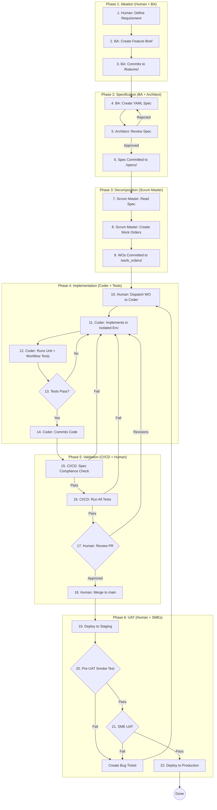

# Complete AOS Development Workflow - End to End

**Version:** 2.0  
**Last Updated:** 2025-10-12  
**Purpose:** Single source of truth for the entire development process, roles, and order of operations

**Governed By:** `/prompts/core/00_NON_NEGOTIABLES.md`

---

## 🎯 **VISUAL SUMMARY: THE CURRENT WORKFLOW**



---

## 🏛️ **GOVERNANCE: THE IMMUTABLE CORE**

Our entire process is governed by **ADR-009: Immutable Core Framework**. This separates artifacts into three rings:

### **Ring 0: The Immutable Core**
**Location:** `/prompts/core/00_NON_NEGOTIABLES.md`  
**What:** The "constitution" - absolute, unchangeable laws  
**Who Can Change:** Human overseer only (technically enforced by pre-commit hooks)

### **Ring 1: The Protected Layer**
**Location:** `/standards/`, `/prompts/`, `/templates/`, `/decisions/`  
**What:** Operational standards, agent primers, ADRs  
**Who Can Change:** Executive Architect proposes → Human overseer approves

### **Ring 2: The Adaptive Layer**
**Location:** `/process_improvement/`, `/bugs/`, GitHub Issues  
**What:** Feedback, logs, discussions  
**Who Can Change:** All agents contribute

---

## 👥 **THE TEAM**

### **Human Roles:**

| Role | Responsibilities |
|------|------------------|
| **Product Owner (James)** | Business requirements, feature priorities |
| **Oversight (James)** | Dispatches agents, reviews work, approves merges |
| **SMEs** | Domain expertise, UAT validation |

### **AI Agent Roles:**

| Agent | Purpose | Token Budget | Creates | Consumes |
|-------|---------|--------------|---------|----------|
| **Executive Architect** | Validates specs, governs architecture | ~4500/week | ADRs, standards updates | Specs, process improvement |
| **Business Analyst** | Requirements to specs | ~3000/feature | Feature briefs, YAML specs | Stakeholder input |
| **Scrum Master** | Work order decomposition | ~2000/feature | Work orders | Specs |
| **Coder Agent** | Implementation | ~5000/WO | Code, tests, PRs | Work orders |
| **UI/UX Agent** | Design | Variable | Mockups, XML views | Specs |
| **GitHub Coach** | Git/GitHub guide | Variable | PRs, branches | Human requests |
| **Doc Retrieval** | Reference docs | One-time | Organized docs | Document requests |

---

## 📋 **PHASE 1: IDEATION**

### **Participants:** Human + Business Analyst

### **Process:**
1. **Human defines requirement** (business need, user problem)
2. **BA interviews** stakeholders and researches domain
3. **BA creates feature brief** in `/features/[domain]/[feature-name]/01-feature-brief.md`
4. **BA commits** feature brief to repository

### **Output:**
- Feature brief document (high-level, business-focused)
- Reference materials in `/features/[domain]/[feature-name]/reference/`

### **Success Criteria:**
- [ ] Clear business problem statement
- [ ] User personas identified
- [ ] Success metrics defined
- [ ] Constraints documented

---

## 📄 **PHASE 2: SPECIFICATION**

### **Participants:** Business Analyst + Executive Architect

### **Process:**
1. **BA reads feature brief** and related ADRs
2. **BA creates YAML spec** using `/specs/templates/STORY.yaml.tpl`
3. **BA defines:**
   - All data models and fields (exact names and types)
   - All business rules (testable, implementable)
   - All acceptance criteria (specific, measurable)
4. **BA submits spec** to Executive Architect for review
5. **Architect reviews** using 5-minute checklist:
   - [ ] No architectural violations (federated model, repo boundaries)
   - [ ] Field names follow conventions
   - [ ] Business rules are implementable
   - [ ] Acceptance criteria are testable
6. **Architect approves or rejects** with specific feedback
7. **If rejected:** BA fixes and resubmits
8. **If approved:** Spec committed to `/specs/[domain]/FEATURE-ID.yaml`

### **Output:**
- Approved YAML specification
- Spec becomes **immutable contract** for implementation

### **Token Budget:**
- BA: ~3000 tokens
- Architect: ~500 tokens (focused review)

### **Success Criteria:**
- [ ] Passes architectural review on first try
- [ ] All sections complete (no TBD)
- [ ] Field names match conventions
- [ ] Business rules testable

**See:** `/specs/README.md` for complete spec creation guide

---

## 🔨 **PHASE 3: DECOMPOSITION**

### **Participants:** Scrum Master (AI)

### **Process:**
1. **Scrum Master reads approved spec** from `/specs/`
2. **Scrum Master analyzes** data models, business rules, dependencies
3. **Scrum Master creates work orders** using `/templates/work_order_template.md`
4. **Each work order must be:**
   - **Bootable:** Odoo won't crash after applying this code
   - **Testable:** Can verify it works
   - **Independent:** Doesn't block other work orders
5. **Scrum Master defines:**
   - Exact files to create/modify
   - Specific code to write (with field names from spec)
   - Test requirements (unit + workflow)
   - Acceptance criteria
6. **Scrum Master commits** to `/work_orders/[domain]/[FEATURE]/WO-XXX-NN.md`

### **Output:**
- Series of hyper-detailed work orders
- TRACKING.md file showing WO status

### **Token Budget:**
- ~2000 tokens per feature decomposition

### **Success Criteria:**
- [ ] Each WO is bootable (includes manifest requirements)
- [ ] Each WO has unit test requirements
- [ ] Each WO has workflow test requirements
- [ ] WOs are properly sequenced (dependencies respected)

**See:** `/prompts/onboarding_scrum_master.md` Section 3.1 for Odoo-aware decomposition patterns

---

## 💻 **PHASE 4: IMPLEMENTATION**

### **Participants:** Coder Agent

### **Process:**
1. **Human dispatches WO** to Coder Agent using consolidated dispatch brief
2. **Coder reads:**
   - Work order
   - Spec (for field names, business rules)
   - Onboarding primer (`/prompts/onboarding_coder_agent.md`)
3. **Coder sets up isolated environment:**
   ```bash
   cd [hub or evv]
   ./scripts/start-agent-env.sh WO-XXX-NN
   ```
4. **Coder implements:**
   - Creates/modifies files per work order
   - Uses EXACT field names from spec
   - Implements business rules as specified
5. **Coder writes tests:**
   - **Unit tests:** Individual functions/methods
   - **Workflow tests:** Complete user journeys (backend)
6. **Coder runs tests locally:**
   ```bash
   python -m pytest addons/[module]/tests/ -v
   ```
7. **Coder provides proof of execution:**
   - Test output (all passing)
   - Boot test confirmation (Odoo starts without errors)
8. **Coder commits** code with conventional commit message
9. **Coder creates PR** linking to work order

### **Output:**
- Implemented code matching spec exactly
- Unit tests (all passing)
- Workflow tests (all passing)
- Pull request

### **Token Budget:**
- ~5000 tokens per work order

### **Success Criteria:**
- [ ] All tests pass locally
- [ ] Spec compliance (field names match)
- [ ] Odoo boots successfully
- [ ] Code follows Odoo standards

**See:** `/prompts/onboarding_coder_agent.md` for complete implementation guide

---

## ✅ **PHASE 5: VALIDATION (CI/CD + Human)**

### **Automated Validation (CI/CD):**

#### **Step 1: Spec Compliance Check**
```bash
python scripts/compare-spec-to-implementation.py [FEATURE-ID]
```
- Validates field names match spec exactly
- Validates field types match spec
- **If fails:** PR blocked, Coder must fix

#### **Step 2: Pre-Commit Hooks**
- Repository boundary validation (no cross-contamination)
- Prevents Ring 0 changes
- **If fails:** Commit blocked

#### **Step 3: Automated Tests**
```bash
# Run all tests in CI
pytest [repo]/addons/[module]/tests/ -v
```
- Unit tests must pass
- Workflow tests must pass
- **If fails:** PR blocked

### **Human Review:**
1. **Human reviews PR** using checklist:
   - [ ] Code matches work order requirements
   - [ ] Tests are comprehensive
   - [ ] No architectural violations
   - [ ] Commit message follows conventions
2. **If revisions needed:** Comment on PR, Coder fixes
3. **If approved:** Human merges to `main`

### **Success Criteria:**
- [ ] Spec compliance validation passes
- [ ] All tests pass in CI
- [ ] Human approves PR
- [ ] No merge conflicts

---

## 🧪 **PHASE 6: PRE-UAT & DEPLOYMENT**

### **Pre-UAT Smoke Test (Human):**

1. **Deploy to staging** (automated or manual)
2. **Human runs Pre-UAT checklist** from `/testing/pre-uat-checks/FEATURE-ID-pre-uat.md`
3. **Smoke test:**
   - Can Odoo start?
   - Can user access the feature?
   - Do basic operations work?
4. **If fails:** Create bug ticket, assign to Coder, repeat Phase 4-5
5. **If passes:** Proceed to UAT

### **User Acceptance Testing (SMEs):**

1. **Human or SME performs full UAT** using acceptance criteria from spec
2. **Test in realistic scenarios** with real-world data (sanitized)
3. **If fails:** Document issues, create bug tickets, repeat Phase 4-5
4. **If passes:** Feature approved for production

### **Production Deployment:**

1. **Human triggers production deploy** (manual gate)
2. **Monitor for errors** in production logs
3. **Rollback if critical issues** discovered
4. **Feature goes live**

### **Success Criteria:**
- [ ] Pre-UAT smoke test passes
- [ ] All UAT acceptance criteria met
- [ ] SMEs approve feature
- [ ] No critical bugs in production first 24 hours

---

## 🔄 **PROCESS IMPROVEMENT LOOP**

### **Continuous:**

After every feature or when issues arise:

1. **Agents log feedback** in `/process_improvement/process-improvement.md`
2. **Executive Architect reviews weekly** for systemic patterns
3. **Architect proposes standard/ADR updates** to address issues
4. **Human approves changes**
5. **Architect updates standards/primers**
6. **All agents notified** of changes

### **Success Metrics:**
- Decreasing process improvement entries over time
- Increasing first-time spec approvals
- Decreasing spec compliance failures
- Decreasing UAT failures

---

## 📚 **KEY REFERENCE DOCUMENTS**

### **Core Governance:**
- `/prompts/core/00_NON_NEGOTIABLES.md` - Ring 0 principles
- `/decisions/009-immutable-core-framework.md` - 3-ring model
- `/standards/00-repository-structure-governance.md` - Where files go

### **Architecture:**
- `/decisions/001-hub-evv-authentication.md` - Federated model
- `/decisions/013-repository-boundaries-and-module-placement.md` - Repo rules
- `/decisions/015-test-environment-isolation-for-parallel-agents.md` - Isolated envs

### **Standards:**
- `/standards/01-odoo-coding-standards.md` - Code quality
- `/standards/03-ai-agent-workflow.md` - Agent processes
- `/standards/SPEC_COMPLIANCE.md` - Spec validation
- `/standards/TESTING_STRATEGY.md` - 5-level test pyramid

### **Onboarding:**
- `/prompts/onboarding_executive_architect.md` - Architect role
- `/prompts/onboarding_business_analyst.md` - BA role
- `/prompts/onboarding_scrum_master.md` - Scrum Master role
- `/prompts/onboarding_coder_agent.md` - Coder role

### **Navigation:**
- `/README.md` - Quick navigation
- `/USER_GUIDE.md` - Comprehensive orientation
- `/prompts/README.md` - Agent primer index
- `/specs/README.md` - Spec creation guide
- `/work_orders/README.md` - Work order lifecycle

---

## 🎯 **SUCCESS CRITERIA FOR ENTIRE WORKFLOW**

**The workflow is successful when:**

1. ✅ **Specs pass architectural review on first try** (clear requirements)
2. ✅ **Work orders are bootable and testable** (quality decomposition)
3. ✅ **Code passes spec compliance validation** (exact field names)
4. ✅ **All tests pass in CI/CD** (comprehensive testing)
5. ✅ **Pre-UAT passes without bugs** (quality implementation)
6. ✅ **UAT passes on first attempt** (requirements met)
7. ✅ **No post-deployment hotfixes** (thorough validation)
8. ✅ **Process improvement entries decrease** (systemic issues resolved)

---

## ⚠️ **COMMON FAILURE POINTS & SOLUTIONS**

### **Failure Point 1: Spec Ambiguity**
**Symptom:** Coder asks many clarification questions  
**Root Cause:** BA didn't specify exact field names or business rules  
**Solution:** BA uses spec quality checklist before submitting

### **Failure Point 2: Spec Compliance Failures**
**Symptom:** CI/CD blocks PR for field name mismatches  
**Root Cause:** Coder didn't use exact names from spec  
**Solution:** Coder reads spec carefully, uses validation script locally

### **Failure Point 3: Non-Bootable Work Orders**
**Symptom:** Odoo crashes after applying code  
**Root Cause:** Scrum Master didn't include manifest requirements  
**Solution:** Scrum Master uses Odoo-aware decomposition patterns (Section 3.1)

### **Failure Point 4: UAT Failures**
**Symptom:** Feature works but doesn't meet business needs  
**Root Cause:** Spec didn't capture actual requirements  
**Solution:** BA conducts thorough stakeholder interviews before spec creation

### **Failure Point 5: Cross-Repo Contamination**
**Symptom:** EVV module in Hub repo (or vice versa)  
**Root Cause:** Coder worked in wrong repository  
**Solution:** Pre-commit hooks block this automatically

---

## 🔧 **AUTOMATION & TOOLS**

### **Pre-Commit Hooks:**
- Repository boundary validation (`scripts/validate-module-placement.sh`)
- Ring 0 protection (blocks changes to `00_NON_NEGOTIABLES.md`)
- Spec compliance validation (`scripts/pre-commit-spec-validation.sh`)

### **CI/CD (GitHub Actions):**
- Spec compliance check (`scripts/compare-spec-to-implementation.py`)
- Automated test execution
- Code quality gates

### **Development Tools:**
- Isolated test environments (`scripts/start-agent-env.sh`)
- Database initialization (`scripts/init-database.sh`)
- Odoo health checks

---

## 📈 **METRICS & MONITORING**

### **Weekly Metrics:**
- Features completed vs. planned
- Average spec review cycles (target: 1)
- Spec compliance pass rate (target: 100%)
- CI/CD test pass rate (target: 100%)
- Pre-UAT pass rate (target: 100%)
- UAT pass rate (target: 100%)

### **Monthly Metrics:**
- Process improvement entries (trending down = good)
- Agent token consumption (within budget?)
- Time from spec approval to production (trending down = good)

---

## 🚀 **GETTING STARTED**

### **For New Features:**
1. Start with feature brief (`/features/[domain]/[feature-name]/`)
2. Follow Phase 1-6 in order
3. Don't skip phases (leads to rework)
4. Use checklists at each phase

### **For New Agents:**
1. Read `/prompts/core/00_NON_NEGOTIABLES.md` first
2. Read your role-specific primer
3. Complete calibration exercise
4. Start with your first assignment

### **For Reviewing This Workflow:**
1. Propose changes via `/process_improvement/`
2. Executive Architect reviews and proposes standard update
3. Human overseer approves
4. This document updated

---

**Version History:**
- **v2.0 (2025-10-12):** Complete rewrite - YAML specs, token-efficient architect, isolated envs, spec compliance
- **v1.0 (2025-10-09):** Initial creation

**Next Review:** After first 3 features complete using this workflow
