# Complete AOS Development Workflow - End to End

**Last Updated:** 2025-10-09  
**Purpose:** The single source of truth for the entire development process, roles, and order of operations. This document is governed by the principles in `prompts/core/00_NON_NEGOTIABLES.md`.

---

## 🎯 **VISUAL SUMMARY: THE MASTER WORKFLOW**

The following diagram illustrates our complete, end-to-end process, from initial idea to production deployment.

```mermaid
graph TD
    subgraph "Phase 1: Design (You & AI BA)"
        A[1. You: Define Requirement] --> B[2. AI BA: Generate User Story];
        B --> C[3. AI BA: Submit Story PR to platform-architecture];
        C --> D{4. You: Review Story PR};
        D -- Approved --> E[5. You: Merge Story PR];
    end

    subgraph "Phase 2: UI/UX Mockup (You, AI UI/UX, & SME)"
        E --> F{6. Does story need a UI?};
        F -- Yes --> G[7. You: Brief AI UI/UX Designer];
        G --> H[8. AI UI/UX: Generate Mockups];
        H --> I[9. You: Add mockup to Story PR];
        I --> J{10. SME: Review Mockup PR};
        J -- Approved --> K[11. You: Merge Mockup PR];
        F -- No --> K;
    end

    subgraph "Phase 3: Decomposition (Automated)"
        K --> L[12. You: Trigger 'Decompose Story' Action];
        L --> M[13. GitHub Action: Reads story, briefs AI];
        M --> N[14. AI Decomposer: Returns JSON of nuclear tasks];
        N --> O[15. GitHub Action: Creates GitHub Issues];
        O --> P[16. GitHub Action: Adds Issues to Project Board];
    end

    subgraph "Phase 4: Development & Deployment"
        P --> Q[17. AI Coder is assigned an Issue];
        Q --> R[18. AI Coder: Writes Code & submits PR];
        R --> S[19. CI Pipeline: Runs tests];
        S -- Fails --> R;
        S -- Passes --> T{20. You: Review Code PR};
        T -- Revisions Needed --> R;
        T -- Approved --> U[21. You: Merge PR to 'staging'];
        U --> V[22. Automated Deploy to Staging];
        V --> W{23. You & SMEs: Perform UAT};
        W -- Fails --> X[Create new Bug Issue];
        X --> P;
        W -- Approved --> Y[24. You: Trigger Prod Deploy];
        Y --> Z((Done));
    end
```

---

## 🏛️ **GOVERNANCE: THE IMMUTABLE CORE**

Our entire process is governed by the **Immutable Core Framework (ADR-009)**. This separates our project artifacts into three rings of authority:

1.  **Ring 0: The Immutable Core (`/prompts/core/`)**
    -   **What:** The "constitution" of the project (`00_NON_NEGOTIABLES.md`). Contains the absolute, unchangeable laws.
    -   **Who Can Change:** Only the human overseer. Changes are technically blocked for all other users and AIs via pre-commit hooks.

2.  **Ring 1: The Protected Layer (`/standards`, `/prompts`, `/templates`)**
    -   **What:** Our operational standards, agent primers, and templates. These are the "laws" that define our workflow.
    -   **Who Can Change:** The Executive Architect AI can propose changes based on trends, but they **must** be approved by the human overseer before being merged.

3.  **Ring 2: The Adaptive Layer (`/process_improvement`, GitHub Issues)**
    -   **What:** The "suggestion box." Contains the raw feedback, logs, and discussions generated by our agents.
    -   **Who Can Change:** All agents contribute to this layer as part of their workflow.

---

## 👥 **THE TEAM**

### **Human Roles:**

| Role | Responsibilities | Activities |
|------|------------------|------------|
| **Product Owner** | Business requirements | Describes features, approves stories |
| **Executive Architect** | Technical direction, ADRs | Approves architecture, reviews process |
| **Developer (James)** | Oversight, orchestration | Dispatches agents, reviews work, merges |
| **Workflow Coach AI** | Guides the human overseer through the established processes, helps dispatch work. |

### **AI Agent Roles:**

| Agent | Purpose | Creates | Consumes |
|-------|---------|---------|----------|
| **Business Analyst (BA)** | Decomposes work | Work Orders (GitHub Issues) | User Stories |
| **Coder Agent** | Implements code | Code, Tests, PRs | Work Orders |
| **Tester Agent** | Validates code | Test reports, bug reports | PRs, code |
| **Reviewer Agent** | Code review | Review comments, approvals | PRs, diffs |
| **Documentation Agent** | Writes docs | Guides, READMEs, API docs | Code, ADRs |

### **Automated Agents:**

| Agent | Purpose | When |
|-------|---------|------|
| **Cursor Bugbot** | Code analysis | On PR creation (manual trigger) |
| **Pre-commit Hooks** | Lint/format | On git commit (when activated) |
| **GitHub Actions** | CI/CD | On push/PR (future) |

---

## 🔄 **COMPLETE WORKFLOW - STEP BY STEP**

---

### **PHASE 1: DEFINITION (The "Upstream")**

#### **Step 1.1: Ideation & Feature Brief**
- **Who:** Human Overseer & Executive Architect
- **What:** A high-level strategic idea is discussed. If deemed viable, the Architect creates a **Feature Brief** in the `/features` directory.

#### **Step 1.2: User Story Creation**
- **Who:** Business Analyst (BA) AI Agent
- **Trigger:** A directive from the Architect to create stories for a Feature Brief.
- **Action:** The BA reads the Feature Brief and all relevant ADRs, then creates detailed user story `.md` files in the `/user_stories` directory, following the official template. Each story includes a mandatory **"Access Control & Permissions"** section.

#### **Step 1.3: The "Upstream" Feedback Loop (Technical Review)**
- **Who:** Coder Agent
- **Trigger:** The BA agent finishes a user story and a `status:needs-technical-review` label is applied.
- **Action (ADR-008):** A Coder Agent is assigned to review the user story for technical feasibility, clarity, and completeness. It provides feedback but does not write code.
- **Loop:** The BA Agent incorporates the feedback, and the story is updated. This loop continues until the technical review is passed.

#### **Step 1.4: Final Architect & Human Approval**
- **Who:** Executive Architect & Human Overseer
- **Action:** The architect performs a final review of the technically-vetted user story, including its security design. Upon approval, an "Epic" issue is created in the `aos-architecture` repository to track its overall progress. The human overseer gives the final go-ahead.

---

### **PHASE 2: DECOMPOSITION & DISPATCH**

#### **Step 2.1: Work Order Creation**
- **Who:** Executive Architect
- **Action:** The Architect decomposes the approved User Story into one or more "nuclear" Work Orders.

#### **Step 2.2: Dispatch**
- **Who:** Human Overseer (guided by the Coach AI)
- **Action:** Creates a GitHub Issue in the target repository (`hub` or `evv`) for each Work Order, using the mandatory `work_order_template.md`. The issue is assigned to the appropriate agent (e.g., `aos-coder-agent`) and labeled correctly.

---

### **PHASE 3: IMPLEMENTATION (The "Downstream")**

#### **Step 3.1: Execution**
- **Who:** Coder Agent
- **Action:** The agent executes the Work Order in a separate feature branch, following all standards, including the **2-iteration limit** for bug fixing. If it gets stuck, it escalates by applying the `status:needs-help` label.

#### **Step 3.2: The "Downstream" Feedback Loop & Handoff**
- **Who:** Coder Agent
- **Action:**
    1.  Upon successful completion, the agent provides the mandatory **"Proof of Execution"** (including test results) as a comment on the GitHub issue.
    2.  The agent also provides structured **Process Improvement Feedback** as a separate comment, answering the three standard questions (Context, Clarity, Tooling).

#### **Step 3.3: Architectural Review & Merge**
- **Who:** Executive Architect & Human Overseer
- **Action:**
    1.  The Architect reviews the PR and the Proof of Execution.
    2.  Upon approval, the Architect posts an "Approved for Merge" comment.
    3.  The **Human Overseer performs the final, authoritative merge** of the Pull Request into the `main` branch. This is a non-negotiable step.

---

### **PHASE 4: PROCESS IMPROVEMENT**

#### **Step 4.1: Logging and Trend Analysis**
- **Who:** Executive Architect
- **Action (ADR-008):** The Architect logs all agent feedback in `process_improvement/process-improvement.md`, analyzes it for trends, and proposes changes to the "Protected Layer" only when a clear pattern of inefficiency or error emerges. All changes require human approval.

---

## 🔍 **KEY QUESTIONS ANSWERED**

### **Who Creates Work Orders?**

**Answer:** Business Analyst (BA) AI Agent OR Human BA

**Process:**
1. BA reads user story
2. BA decomposes into atomic work orders
3. BA creates GitHub Issues in target repo (hub/evv)
4. BA uses Work Order Template (mandatory structure)
5. BA assigns labels for routing

**Context Management Note:**
- BA MUST size work orders to fit agent context budget
- Target: < 500 lines of changes
- If larger: Break into multiple work orders
- Document dependencies

---

### **Where is Context Management Considered?**

**Answer:** At MULTIPLE levels:

1. **Work Order Creation (BA Agent):**
   - Size work appropriately (< 500 lines)
   - Clear scope definition
   - Single responsibility

2. **Work Order Template:**
   - Section 6: Context Management guidelines
   - 2-iteration limit documented
   - Escalation process provided

3. **Coder Agent Workflow:**
   - Git checkpoints (external memory)
   - Phase-based context budget (30% per phase)
   - Iteration limit enforcement
   - Escalation triggers

4. **Testing Standards:**
   - Workflow documented
   - Escalation path clear
   - Signs of context exhaustion

**Key Point:** Context management is ARCHITECTURAL, not just tactical!

---

### **When Does Same Agent vs Separate Agent Apply?**

**Answer:** Default is SAME agent, separate only for complex cases

**Same Agent (90% of tasks):**
- Task < 500 lines
- Standard refactoring
- Feature implementation
- Bug fixes
- Documentation

**Separate Test Agent (10% of tasks):**
- Task > 500 lines
- High bug risk (security, critical logic)
- Complex refactoring
- Coder already used 50%+ context

**Decision Made By:** BA during work order creation OR Developer during dispatch

---

### **What Happens When Agent Gets Stuck?**

**Answer:** 2-iteration limit → Escalation

**Process:**
1. Agent tries fix (Iteration 1)
2. If fails, agent tries DIFFERENT fix (Iteration 2)
3. If still fails, agent STOPS and escalates
4. Agent documents attempts on GitHub Issue
5. Agent adds `status:needs-help` label
6. Agent tags reviewer
7. Human/specialist reviews and assists

**Why This Works:**
- Prevents context exhaustion
- Documents what was tried (no duplication)
- Gets expert help early
- Preserves agent context for useful work

---

## 📊 **WORKFLOW METRICS**

### **Typical Timeline:**

| Phase | Duration | Who |
|-------|----------|-----|
| User Story Creation | 15-30 min | Product Owner/Architect |
| Architectural Review | 30-60 min | Executive Architect |
| Decomposition | 30-60 min | BA Agent |
| Work Order Dispatch | 5 min | Developer |
| Implementation | 2-4 hours | Coder Agent |
| Testing | 1-2 hours | Coder Agent |
| Bug Fixing | 30 min - 2 hours | Coder Agent |
| Proof of Execution | 15-30 min | Coder Agent |
| Review | 30 min - 1 hour | Reviewer/Human |
| Merge | 5 min | Developer |
| **Total:** | **5-11 hours** | **Team** |

**Factors Affecting Duration:**
- Task complexity
- Agent type/performance
- Testing requirements
- Bug complexity
- Review thoroughness

---

### **Success Criteria:**

| Metric | Target | Actual (Today) |
|--------|--------|----------------|
| **First-Pass Quality** | > 80% | 33% (1/3 agents) |
| **Test Coverage** | > 80% | 100% (where tests exist) |
| **Proof of Execution** | 100% | 67% (2/3 agents) |
| **ADR Compliance** | 100% | 100% |
| **Process Improvement** | Active | ✅ 2 entries |
| **Documentation Quality** | High | ✅ A+ grade |

**Note:** First-pass quality low due to first agent failure. Monitoring for pattern.

---

## 🎯 **CRITICAL SUCCESS FACTORS**

### **1. Work Order Quality** 🔴 CRITICAL

**Why It Matters:**
- Clear work order = successful implementation
- Vague work order = agent confusion/failure
- Context management starts here

**Requirements:**
- Use Work Order Template (all 8 sections)
- Specific file paths, line numbers, code snippets
- Clear acceptance criteria
- Appropriate sizing (< 500 lines)
- Required context documents listed

---

### **2. Testing Standards** 🔴 CRITICAL

**Why It Matters:**
- Boot testing caught 0/6 bugs
- Functional testing would catch 67-100%
- Quality gate to prevent production bugs

**Requirements:**
- Unit tests MANDATORY for code changes
- Tests must cover edge cases, errors, security
- Proof of execution includes test output
- 0 failures required before merge

---

### **3. Context Management** 🟡 HIGH IMPORTANCE

**Why It Matters:**
- Prevents agent context exhaustion
- Avoids infinite debug loops
- Maintains work quality

**Requirements:**
- 2-iteration limit enforced
- Git checkpoints after each phase
- Escalation path clear
- Context budget guidelines followed

---

### **4. Process Improvement** 🟡 HIGH IMPORTANCE

**Why It Matters:**
- Continuous learning
- Pattern identification
- Standards evolution

**Requirements:**
- Log after each failure
- Log when patterns emerge
- Review weekly
- Update standards based on findings

---

## 🚀 **IMPROVEMENTS MADE TODAY**

**Based on this workflow analysis, we made:**

1. ✅ **Testing Standards** - Comprehensive guidelines for agents
2. ✅ **Context Management** - Built into Work Order Template
3. ✅ **Enhanced Proof of Execution** - Now includes functional tests
4. ✅ **Process Improvement Log** - 2 entries demonstrating continuous learning
5. ✅ **Pre-commit Hooks** - Automated quality checks

**Impact:** More mature, sustainable development process

---

## 📝 **REFERENCE DOCUMENTS**

**Core Workflow:**
- `aos-architecture/00_project_workflow.md` - Master blueprint
- `aos-architecture/standards/03-ai-agent-workflow.md` - Agent processes

**Standards:**
- `aos-architecture/standards/08-testing-requirements.md` - Testing guidelines
- `aos-architecture/standards/05-automation-and-labeling-standards.md` - Labels, handles

**Templates:**
- `aos-architecture/templates/work_order_template.md` - Work order structure
- `.github/ISSUE_TEMPLATE/work-order-coder.yml` - GitHub issue template

**Agent Onboarding:**
- `aos-architecture/prompts/onboarding_coder_agent.md` - Coder agent briefing

**Process Improvement:**
- `aos-architecture/process_improvement/process-improvement.md` - Learning log

---

## ✅ **NEXT STEPS**

1. **Immediate:**
   - [ ] Architect reviews and approves workflow
   - [ ] Apply to Issue #4
   - [ ] Monitor agent performance

2. **This Week:**
   - [ ] Activate pre-commit hooks
   - [ ] Update GitHub Issue Templates
   - [ ] Create BA agent dispatch instructions

3. **Next Sprint:**
   - [ ] Automate work order creation
   - [ ] Implement automated proof-of-execution validation
   - [ ] Create agent type selection guidance

---

**This is now our definitive workflow reference! 🚀**

