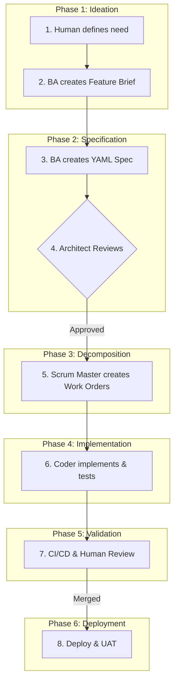

# 00: AOS Workflow Overview & Governance

**Last Updated:** 2025-10-12
**Purpose:** This document provides the high-level overview of the AOS development process and the core governance model that underpins it.

---

## 🎯 **VISUAL SUMMARY: THE MASTER WORKFLOW**

The following diagram illustrates our complete, end-to-end process, from initial idea to production deployment. Each phase is detailed in its own document within this directory.

---

## 🏛️ **GOVERNANCE: THE IMMUTABLE CORE**

Our entire process is governed by **ADR-009: Immutable Core Framework**. This separates artifacts into three rings of authority:

1.  **Ring 0: The Immutable Core (`/prompts/core/`)**
    -   **What:** The "constitution" of the project (`00_NON_NEGOTIABLES.md`).
    -   **Who Can Change:** Human overseer only.

2.  **Ring 1: The Protected Layer (`/standards`, `/prompts`, `/templates`, `/decisions`)**
    -   **What:** Our operational standards, agent primers, and ADRs.
    -   **Who Can Change:** Executive Architect proposes → Human overseer approves via PR.

3.  **Ring 2: The Adaptive Layer (`/process_improvement`, GitHub Issues)**
    -   **What:** Feedback, logs, and discussions.
    -   **Who Can Change:** All agents contribute.
