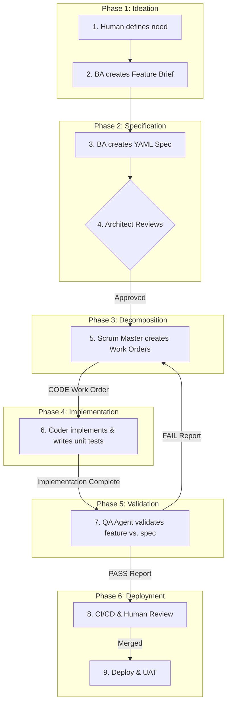

# 00: AOS Workflow Overview & Governance

**Last Updated:** 2025-10-12
**Purpose:** This document provides the high-level overview of the AOS development process and the core governance model that underpins it.

---

## 🎯 **VISUAL SUMMARY: THE MASTER WORKFLOW**

The following diagram illustrates our complete, end-to-end process, from initial idea to production deployment. Each phase is detailed in its own document within this directory.

---

##  Phased Workflow Explained

The workflow is divided into distinct phases, each with a specific agent and purpose.

1.  **Ideation & Specification (Business Analyst):** A human-defined need is translated into a machine-readable `Story.yaml` file.
2.  **Architectural Review (Executive Architect):** The specification is reviewed for compliance with our core principles.
3.  **Decomposition (Scrum Master):** The approved story is broken down into granular `CODE` and `QA` work orders.
4.  **Implementation (Coder Agent):** The Coder Agent receives `CODE` work orders and builds the specified functionality, including necessary **unit tests**.
5.  **Validation (QA Agent):** This is a critical quality gate. After the Coder Agent's work is complete, the QA Agent receives the corresponding `QA` work order. Their role is to:
    -   Perform integration and validation testing.
    -   Test the feature against the original story's acceptance criteria.
    -   Produce a definitive `PASS` or `FAIL` report.
    -   **The QA Agent does not fix bugs.** If a test fails, the `FAIL` report is sent back to the Scrum Master, who creates a new `CODE (BUGFIX)` work order. This loop continues until the QA Agent issues a `PASS` report.
6.  **Deployment (CI/CD & Human Review):** Once a feature has passed QA validation, the final code is reviewed, merged, and deployed.

---

## 🏛️ **GOVERNANCE: THE IMMUTABLE CORE**

Our entire process is governed by **ADR-009: Immutable Core Framework**. This separates artifacts into three rings of authority:

1.  **Ring 0: The Immutable Core (`/prompts/core/`)**
    -   **What:** The "constitution" of the project (`00_NON_NEGOTIABLES.md`).
    -   **Who Can Change:** Human overseer only.

2.  **Ring 1: The Protected Layer (`/standards`, `/prompts`, `/templates`, `/decisions`)**
    -   **What:** Our operational standards, agent primers, and ADRs.
    -   **Who Can Change:** Executive Architect proposes → Human overseer approves via PR.

3.  **Ring 2: The Adaptive Layer (`/process_improvement`, GitHub Issues)**
    -   **What:** Feedback, logs, and discussions.
    -   **Who Can Change:** All agents contribute.
